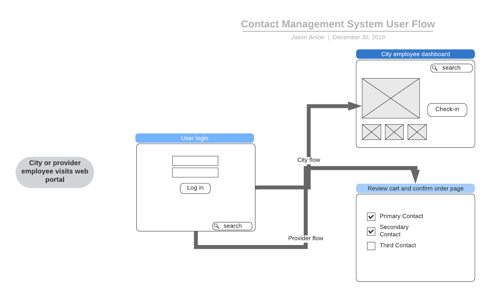

# Tech Spec

*_Healthcare Rollcall_* is an open-source project designed to be used by the City of Baltimore to supplement its existing emergency response plan. The application will be an API-first project to ensure maximum extendibility and flexibility..

## Overview

In the event of a disaster (defined as greater than 20% of the city being without electrical power), Baltimore City and the Baltimore City Health Department (BCHD) is required, by law, to verify the electrical power status of all healthcare providers in the city. This system will provide methods for healthcare providers to check-in during disasters, and update their information during non-emergency periods. During an emergency this system will track if any provider:

* Has power
* Is running on backup power
* Has no power

This system will make use of digital services and modern methodologies to automate parts of the check-in process to help the city prioritize its call list and response plan. Additionally, the system will validate contact information regularly during non-emergency times to ensure the city has the most up-to-date information for each provider.

## Scenarios

Healthcare Rollcall is a multi-faceted and interconnected system with various check-in methods to a single source content management system and event dashboard. In this section we will review scenarios for how this system will be used by various identified stakeholders of the project.

### Flexible check-in process

_Johns Hopkins Hospital_ keeps a staff on-call during emergency situations. There could be one or many individuals with the authority to confirm the hospital's status in an emergency. During an emergency situation the individuals with the authority to confirm will also have many other responsibilities, some of which could mean life and death.

With _Healthcare Rollcall_ the hospital can provide current and accurate information to the City of Baltimore in a number of ways. The system will allow an automated check in via an app that sends push notifications to remind authorized users. This way hospital employees can provide the city with the information it needs to prioritize response without sacrificing time and attention that could be used elsewhere.

During non-emergency times the hospital staff can use the system to list responsible individuals, grant access as needed, and otherwise keep their contact information and preferences current.

### Up to date info

Many providers in Baltimore City are smaller care facilities who care for only a few patients at a time. These facilities may only have a few employees, and may lack the resources of the larger hospitals. In these cases higher-tech solutions, and a contact tree, may turn out to be more of a burden than a help.

The flexibility of the contact management system will allow smaller facilities to simply provide up to date phone contact information so the city can take the initiative to check-in during an emergency. Non-emergency time will give the smaller facilities time to easily and quickly update their contact information.

### City dashboard

City employees need to be enabled to keep track of the status of more than 400 facilities in the greater Baltimore area. During an emergency this can mean calling and re-calling all 400 facilities on the list in no particular order.

With the dashboard present in the web app city employees can be notified of expired updates and better prioritize the call list based on more up-to-date information shared between city employees.

A dashboard view can provide each employee as much information as they need to know at any given time to make the most efficient use of the time in a crisis when every second counts.

## Non Goals

1. _Mobile app_: The initial product will not include a dedicated mobile app for any mobile platform.
2. _Hardware-based check-in solutions_: The initial product will not provide any hardware specific implementation of a check-in process.
3. _Role-based dashboards_: The initial product will not provide customizable dashboards for various city user roles. A single dashboard with all information will be developed.

## Minimum Viable Product

1. _Automated or semi-automated check-in system_: The system will allow providers to automatically, or semi-automatically, check-in with the city and provide their status in an emergency.
2. _Emergency administration and triage dashboards_: The system will have a detailed dashboard tailored to specific roles within a response team to inform city workers of the state of responses and assign priorities.
3. _Contact management system_: The system will include methods to verify and update provider contact information.
4. _Extendability_: The system will be designed to interface with other systems to integrate information as it becomes available (ie: power grid data).

## Components

This system will be comprised of a single _Content Management System_ (CMS) and the potential for many check-in applications.

### Contact Management System

[VueJS](https://vuejs.org/) - Client Logic and display framework in JavaScript, HTML, and CSS. A peer to Angular and React, but is Open Source.

#### Server Technologies

[Node JS](https://nodejs.org/en/) JavaScript runtime environment
Node provides the following services

* Package management
* JS interpreter for logic (routing, business, database access, etc.)

[Express JS](https://expressjs.com/en/guide/routing.html) Provides the http(s) server for the application
Express JS provides the interface between the the web client and the server-side logic. Runs on Node.

[Docker](https://www.docker.com/products/docker-desktop) Container system. Used for code deployment and server configuration. This allows developers to run the product locally on an identical environment as the Cloud application. Typically, a we would set up Docker container on a Cloud vender which runs the Node environment. There are docker containers for almost any runtime environment under the sun.

[Heroku](https://www.heroku.com/) The standard cloud vender for _Code for Baltimore._ A competitor to AWS, Google Cloud, Azure etc.

#### Database

[PosgreSQL](https://www.docker.com/products/docker-desktop) Heroku's preferred relational database technology. Uses the popular SQL standard.

## Roadmap

### Research

Code for Baltimore and partners will conduct research to identify UX priorities, alert and check-in methods, and how the product can best supplement Baltimore’s response plan.

### Development

Each high-level component of the system will be developed as on its own with its own roadmap and Github project. These projects will include:

* Research
* Content Mangement System and Crisis Management Dashboard
* Check-in applications

### Implementation

Based on development timelines implementation of the system will be rolled out in phases.

## Contact Info

* _Tech Lead_: [Jason Anton](https://github.com/revjtanton)
* _Developer_: [Jason Bixon](https://github.com/jbixon13)
